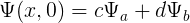

# Quantum-mechanics

HARMONIC OSCILLATOR.

Plot any linear combination of any two stationary states of the quantum harmonic oscillator after any time t.

General form : 

  

Input a, b, c, d and t to plot  Ψ(x,t)
